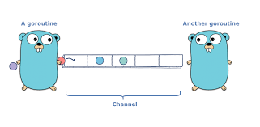

# channel

### Channel 用途&#x20;

Channel 可以在 Goroutines 間<mark style="color:blue;">同步的處理資料</mark>，而不用使用明確的 lock, unlock 等方法保證變數的安全性。

* Channel就像是一個Queue, 遵守著FIFO的規則
* 保證收發資料的順序 訊息通道與傳遞：
* 生產者消費者模型&#x20;
* 互斥鎖, channel内部有Mutex&#x20;
* 含有buffersize 的通道 預設雙向，可以控制關閉通道。



### 宣告方式:&#x20;

var 通道名稱 <mark style="background-color:green;">chan</mark> 通道類型&#x20;

chan的空值是nil，透過make來產生實例。

make(chan 通道類型, bufferSize)


ch := make(chan int)&#x20;

ch <- v **// Send v to channel ch**

v := <-ch **// Receive from ch, and // assign value to v.**

****

Go play : [https://tour.golang.org/concurrency/2](https://tour.golang.org/concurrency/2)


#### channel通道大小

宣告通道實例時，有分無緩衝區(Unbuffered )的通道

```
ch := make(chan int) // Unbuffered 兩個goroutine一發一收,  size為0
ch := make(chan int, 100) // Buffered  發送方可以一直塞,除非塞滿不會阻塞
```


### 注意**channel的阻塞**

一般的讀寫用法，當通道滿的時候，goroutine就會阻塞等待可以再塞才會往下進行。&#x20;

使用channel需注意的問題:&#x20;

* 發送資料量必須在消費方處理量+通道長度的範圍內, 才能正確的處理&#x20;
* 通常滿了可能超過表示超過負荷，短時間內容易造成，但應要可以消化。
* &#x20;通道大小可以視情況調整，但不應該無限開大，可能會佔記憶體，另外如果發送方永遠大於消費方速度，不管再大都不夠放。&#x20;
* 注意關閉channel時機，但當還有goroutine往裡面送會引發panic

```
go func() {
….
ch <-value  //假設這是一個滿的channel，會塞不進去，阻塞並等待,正常處理時不會發生。
fmt.print(“done”)  //這段要等塞完才會繼續。
}()

```

**讀寫channel的幾種不同寫法**

* 一般的讀寫用法，當通道滿的時候，goroutine就會阻塞等待可以再塞才會往下進行。
* 使用Select寫法default或timeout實現無阻塞讀寫，但要注意阻塞時處理方式避免丟失。
* &#x20;當通常滿了之後經由default處理 當一段時間未收到進行處理&#x20;
* 使用select同時處理多個channel通道（但只處理最先發生的channel）&#x20;
* 讀取端：除了<- 也可以改用 for i := range ch 來不斷從 channel 接收值，直到它被關閉&#x20;
* 讀取端：\_, ok := <-ch, ok用來判斷通道是否關閉&#x20;
* 讀取端：worker pool的設計常用来加速處理執行較耗时的重任務，且為避免goroutine的過度創建，需要指定工作池的大小 -> https://gobyexample.com/worker-pools&#x20;
* 使用chan struct{}空結構體作为信號channel ….
