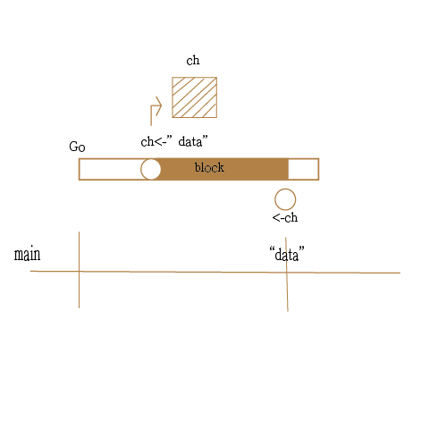

# channel 阻塞

### channel通道大小

宣告通道實例時，有分無緩衝區(Unbuffered )的通道

```
ch := make(chan int) // Unbuffered 兩個goroutine一發一收,  size為0
ch := make(chan int, 100) // Buffered  發送方可以一直塞,除非塞滿不會阻塞
```

### unbuffered channel&#x20;

#### push block

* 宣告一個unbuffered channel
* 推資料進去，在還沒有人拉出資料時會一直等待（block）

<details>

<summary>範例</summary>

```
package main

import (
	"log"
	"time"
)

//Goroutine 推資料入 Channel 時的等待情境
// channel-block-push.go
func main() {

	log.Println("main goroutine start")
	ch := make(chan string) //unbuffer channel

	go func() { // calculate goroutine
		log.Println("goroutine starts calculating 1s")
		time.Sleep(time.Second) // Heavy calculation
		log.Println("goroutine push data...block...")

		ch <- "data" // goroutine 執行會在此被迫等待 block...

		log.Println("goroutine push data finished")
	}()

	time.Sleep(10 * time.Second) // 使 main 比 goroutine 慢
	log.Println("main goroutine get data after 5s")
	log.Println(<-ch)
	time.Sleep(time.Second)
	log.Println("main goroutine finished")
}

```

</details>

<details>

<summary>圖示</summary>



</details>

#### pull block

* 宣告一個unbuffered channel
* 拉資料出來，在還沒有人推入資料時會一直等待（block）

<details>

<summary>程式碼</summary>

```
//package main

import (
	"log"
	"time"
)

//Goroutine 拉資料出 Channel 時的等待情境
func main() {
	ch := make(chan string)

	go func() {
		log.Println("calculate goroutine starts calculating")
		time.Sleep(10*time.Second) // Heavy calculation
		log.Println("calculate goroutine push data after 10s")
		ch <- "FINISH"

		log.Println("calculate goroutine finished")
	}()

	log.Println("main goroutine is waiting for channel to receive value")
	log.Println(<-ch) // goroutine 執行會在此被迫等待
	log.Println("main goroutine finished")
}

```

</details>
