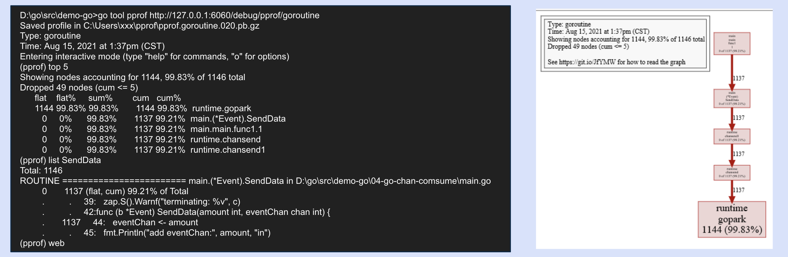

# pprof

### **pprof 分析檢測工具**

Go Profiler : pprof 是 golang 官方提供的效能調優分析工具，可以對程式進行效能分析，並可視化資料。 程式要先加入相關檢測程式碼&#x20;

* runtime/pprof：採集程式執行資料進行效能分析，一般用於後臺工具型應用，這種應用執行一段時間就結束，可生成文件供後續分析。&#x20;
* net/http/pprof：對 runtime/pprof 的二次封裝，一般是服務型應用。比如 web server\
  http: 直接訪問: http://127.0.0.1:6060/debug/pprof/

```
Types of profiles available:
Count	Profile
2	allocs   //過去所有對象分配的記憶體
0	block     //Goroutine阻塞事件的記錄。默認每發生一次阻塞事件時取樣一次。(預設是關閉的，需要另開runtime.SetBlockProfileRate(1) )
0	cmdline //當前程序的命令行調用
8	goroutine    //活動Goroutine的信息記錄，僅在獲取時取樣一次。
2	heap    // 當前活躍對象堆內存分配情況的記錄。默認每分配512K字節時取樣一次。
0	mutex  // 查看爭用互斥鎖的持有者 (預設是關閉的，runtime.SetMutexProfileFraction(1))。
0	profile  // CPU profile. 可以使用GET 帶參數(s)獲取一段時間內，採樣完成會生成一份文件供進一步分析
7	threadcreate //系統線程創建情況的記錄，僅在獲取時取樣一次。
0	trace //帶有時間軸分析，可以使用GET 帶參數(s)獲取，採樣完成會生成一份文件供進一步分析
```

### **go tool pprof**

**進一步使用go tool pprof   + http://host:port/debug/pprof/\<Type>?    (seconds=30)  分析細節。**

* go tool pprof 分析結果的工具，可以用 command line 也可以用網頁的形式
* go tool pprof + http://127.0.0.1:6060/debug/pprof/ (?seconds=30)&#x20;
* Ex: go tool pprof http://127.0.0.1:6060/debug/pprof/goroutine 分析gorountine阻塞&#x20;
* Ex: go tool pprof http://127.0.0.1:6060/debug/pprof/profile?seconds=30 分析查看 30 秒内的 CPU&#x20;
* → Top：類似 linux top&#x20;
* → List func 可以看程式碼阻塞在哪
* web 繪出可視化圖形 特別是對於“runtime.gopark”，這表示goroutine將處於“掛起”狀態，由運行時調度程序暫停


